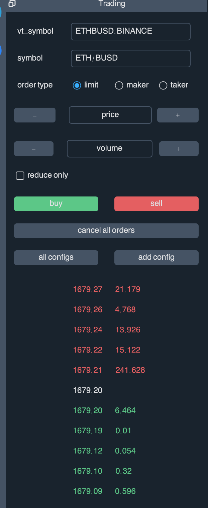
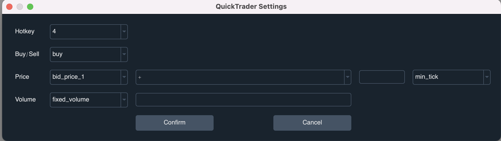
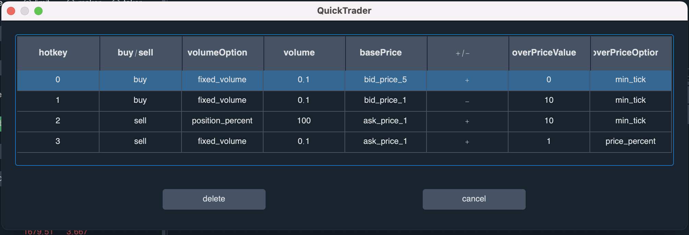

# HowTrader

HowTrader 是一个数字货币量量化交易的框架，由于核心代码是Forked
VNPY,所以用法和功能基本上跟VNPY相似。但是对VNPY源码的一些bugs进行了修复，并扩展了Tradingview信号的对接，以及增加网格策略等功能。
由于VNPY的代码依赖过多，对一些用不到的代码进行了删除，保留核心的功能。


[howtrader开发文档](./docs/howtrader文档说明.md)


## Howtrader 和 VNPY区别对比
1. 个别类的定义不同: OrderData(订单数据)
   、TradeData(成交数据)、ContractData(交易对信息)
   这几个类，为了满足下单精度要求，把float类型替换成精度更高的Decimal。
   他们的定义在howtrader.trader.object模块中。
  
2. on_order和on_trade的推送顺序不同:
   VNPY中，会先推送订单状态的改变会先推送on_order，
   如果有成交的数据话，在继续推送on_trade成交数据,
   然后根据成交的数据计算cta策略中的self.pos仓位数据。但是在实际使用中，由于self.pos是系统计算的，
   如果我们要想在on_order状态改变的时候，获得当前的pos仓位数据，
   我们需要自己定义个current_pos变量来记录数据。为改变这种方式，在howtrader框架中，我们处理方式是，先推送on_trade成交数据，然后再推送on_order订单状态。具体代码参考gateway类中的实现，部分代码如下：
   ``` python
       
       def on_order(self, order: OrderData) -> None:
        """on order update"""
        order.update_time = generate_datetime(time.time() * 1000)
        last_order: OrderData = self.get_order(order.orderid)
        if not last_order:
            self.orders[order.orderid] = copy(order)
            super().on_order(copy(order))

        else:
            traded: Decimal = order.traded - last_order.traded
            if traded < 0: # filter the order is not in sequence
                return None

            if traded > 0:
                trade: TradeData = TradeData(
                    symbol=order.symbol,
                    exchange=order.exchange,
                    orderid=order.orderid,
                    direction=order.direction,
                    price=order.price,
                    volume=traded,
                    datetime=order.update_time,
                    gateway_name=self.gateway_name,
                )

                super().on_trade(trade)

            if traded == 0 and order.status == last_order.status:
                return None

            self.orders[order.orderid] = copy(order)
            super().on_order(copy(order))

    def get_order(self, orderid: str) -> OrderData:
        """get order by order id"""
        return self.orders.get(orderid, None)
   
   ```

3. gateway实现的不同: 里面增加了断开重连，以及更多的处理细节，具体可以参考对比代码

4. 增加了Tradingview等第三方信号对接，具体可以查看howtrader.app.tradingview模块


## 安装

由于项目里面用到pandas, 
Numpy等科学计算的库，为了方便安装，这里建议使用Anaconda进行安装。

1. 安装Anaconda
   具体下载地址如下[https://www.anaconda.com/products/distribution](https://www.anaconda.com/products/distribution)，在安装的过程中，记得要勾选把conda加入的系统目录，如果你忘记的话，可以卸载卸载，然后重新安装，或者查找下如何把conda添加进系统里面，不然你可能在命令行中
   输入conda的时候，提示你找不到conda命令。
   
   如果你已经安装了anaconda, 你要更新到最新版本的anaconda,
   你可以通过一下命令进行更新: 
   > conda update conda
   
   > conda update anaconda

2. 安装git工具

建议你参考廖雪峰老师的博客[https://www.liaoxuefeng.com/wiki/896043488029600/896067074338496](https://www.liaoxuefeng.com/wiki/896043488029600/896067074338496)，里面有具体的安装教程。
如果比较熟练掌握软件的安装可以直接通过网页[https://git-scm.com/downloads](https://git-scm.com/downloads)下载git,
然后直接安装。同样最重要的是你要记得把git添加到系统路径中，不然在命令上中输入git会提示你找不到git工具。

3. 利用conda 创建虚拟环境
> conda create -n mytrader python==3.9

如果你之前创建了mytrader的虚拟环境，如果不想使用了，你可以先卸载掉，然后再创建一个mytrader，卸载的命令如下:
> conda remove -n mytrader --all

如果提示错误的话，你要看你当前激活的虚拟环境是不是mytrader,如果当前激活的是mytrader，那么先执行:
> conda deactivate 

然后再执行:
> conda remove -n mytrader --all

这里mytrader是你的虚拟环境的名称，你当然可以取其他名字，
但是记得要用英文。另外你的虚拟的路径最好不要出现中文的文件路径，不然可能出现一些未知问题。

4. 激活你的虚拟环境名称
> conda activate mytrader

5. 安装howtrader 

直接输入如下命令
> pip install git+https://github.com/51bitquant/howtrader.git

如果你发现有bug或者有新的版本更新，你可以输入以下命令进行更新：
> > pip install git+https://github.com/51bitquant/howtrader.git -U 

如果提示你没有git, 那么你需要去安装git软件，具体的话参考系列课程的第十三课的视频。


如果你想通过代码来安装，可以把代码下载下来，然后切换到你的虚拟环境，或者使用当前的环境也是可以的， 在终端输入：

> pip install -r requirements.txt 

> python setup.py install

但是我们直接推荐你用pip来安装，这样它能帮你把各种依赖处理好，减少错误的发生。

## 卸载howtrader
如果你发现代码更新不了或者其他问题，可以先卸载再安装, 命令如下：
> pip uninstall howtrader

## 查看版本
```
import howtrader

print(howtrader.__version__)

```

## window TA-Lib安装过程

如果提示你安装不了howtrader，那么大概率是因为ta-lib安装不成功， ta-lib具体安装过程如下：

1. 打开下载地址: https://www.lfd.uci.edu/~gohlke/pythonlibs/#ta-lib

2. 在网页中搜索ta-lib找到ta-lib的包:
   TA_Lib‑0.4.24‑cp39‑cp39‑win_amd64.whl,
   记得下载自己对应的python版本，TA_Lib-0.4.24, 是Ta-Lib版本为0.4.24， 
   cp39就是python3.9版本， amd64就是64位的意思。

3. 通过pip命令安装, 记得通过conda activate
   mytrader来激活你的python解析器，同时命令行要切换到下载Ta-Lib的文件目录，不然提示你找不到要安装的TA_Lib文件，最后通过命令行来安装：
   
> pip install TA_Lib‑0.4.24‑cp39‑cp39‑win_amd64.whl

## macOS 安装TA-Lib
1. 安装Xcode
2. 安装brew, 文档地址https://docs.brew.sh/Installation

3. 执行安装命令
> brew install ta-lib

4. 安装ta-lib的python库
> pip install TA-Lib


## 安装howtrader问题
1. ssl错误，
   可以参考该文档：[https://wenku.baidu.com/view/e6ad1208b7daa58da0116c175f0e7cd1842518e4.html](https://wenku.baidu.com/view/e6ad1208b7daa58da0116c175f0e7cd1842518e4.html)

2. 安装完成后，提示没有找到QT，如提示***this application failed to start
   because no QT platform plugin could be initialized***,
   具体可以参考下面的博客: [https://www.freesion.com/article/8447805324/](https://www.freesion.com/article/8447805324/)

3. 如果安装talib有问题，可以通过以下方式处理：
> brew uninstall ta-lib

> pip uninstall ta-lib

> conda install -y -c conda-forge ta-lib

具体参考改ta-lib的issue: [https://github.com/mrjbq7/ta-lib/issues/381](https://github.com/mrjbq7/ta-lib/issues/381)

## 使用

创建一个python空的python项目，里面创建一个main.py，然后把该项目的解析器设置为刚才创建的mytrader解析器。

main.py文件的项目代码配置为如下:

``` python


from howtrader.event import EventEngine, Event
from howtrader.trader.event import EVENT_TV_SIGNAL
from howtrader.trader.engine import MainEngine
from howtrader.trader.ui import MainWindow, create_qapp
from howtrader.trader.setting import SETTINGS
from howtrader.gateway.binance import BinanceUsdtGateway, BinanceSpotGateway, BinanceInverseGateway

from howtrader.app.cta_strategy import CtaStrategyApp
# from howtrader.app.data_manager import DataManagerApp
# from howtrader.app.data_recorder import DataRecorderApp
# from howtrader.app.algo_trading import AlgoTradingApp
# from howtrader.app.risk_manager import RiskManagerApp
# from howtrader.app.spread_trading import SpreadTradingApp
from howtrader.app.tradingview import TradingViewApp
from threading import Thread
import json
from flask import Flask, request

# create global event_engine
event_engine: EventEngine = EventEngine()
passphrase = SETTINGS.get("passphrase", "")
port = SETTINGS.get("port", 9999)

app = Flask(__name__)

@app.route('/', methods=['GET'])
def welcome():
    return "Hi, this is tv server!"

@app.route('/webhook', methods=['POST'])
def webhook():
    try:
        data = json.loads(request.data)
        if data.get('passphrase', None) != passphrase:
            return {"status": "failure", "msg": "passphrase is incorrect"}
        del data['passphrase'] # del it for safety.
        event:Event = Event(type=EVENT_TV_SIGNAL, data=data)
        event_engine.put(event)
        return {"status": "success", "msg": ""}
    except Exception as error:
        return {"status": "error", "msg": str(error)}

def start_tv_server():
    app.run(host="127.0.0.1", port=port)

def main():
    """"""
    qapp = create_qapp()
    main_engine = MainEngine(event_engine)

    main_engine.add_gateway(BinanceSpotGateway)
    main_engine.add_gateway(BinanceUsdtGateway)
    main_engine.add_gateway(BinanceInverseGateway)
    main_engine.add_app(CtaStrategyApp)
    main_engine.add_app(TradingViewApp)

    # if you don't use
    # main_engine.add_app(DataManagerApp)
    # main_engine.add_app(AlgoTradingApp)
    # main_engine.add_app(DataRecorderApp)
    # main_engine.add_app(RiskManagerApp)
    # main_engine.add_app(SpreadTradingApp)

    main_window = MainWindow(main_engine, event_engine)
    main_window.showMaximized()

    t1 = Thread(target=start_tv_server)
    t1.daemon = True
    t1.start()

    qapp.exec()


if __name__ == "__main__":
    main()

```

主要是从howtrader框架中导入所需的各个模块。具体各个模块的部分我们后面会通过文档来描述。

运行该main.py文件，系统会帮你创建一个叫howtrader的文件夹，里面放各种配置文件，已经log日志等。

## 爬取币安数据

系统框架默认使用sqlite数据库，支持mongodb和mysql数据，如果你想使用mongodb或者mysql数据库，那么你需要你安装并修改howtrader/vt_setting.json进行修改，
具体配置的字典参考框架的howtrader/trader/setting.py中的配置字典，其相应的配置字段如下：

```dict
{
    "font.family": "",  # 设置字体，如果显示不正确的话，设置为系统的一个字体
    "font.size": 12,

    "log.active": True,
    "log.level": CRITICAL,
    "log.console": True,
    "log.file": True,

    "email.server": "smtp.qq.com",
    "email.port": 465,
    "email.username": "",
    "email.password": "",
    "email.sender": "",
    "email.receiver": "",

    "order_update_interval": 600, # securing correct orders' status by synchronizing/updating orders through rest api
    "update_server_time_interval": 300,  # sync with server time
    "passphrase": "howtrader",  # tv passphrase
    "port": 9999, # tv server port

    "datafeed.name": "",
    "datafeed.username": "",
    "datafeed.password": "",

    "database.timezone": get_localzone_name(),
    "database.name": "sqlite",
    "database.database": "database.db",
    "database.host": "",
    "database.port": 0,
    "database.user": "",
    "database.password": ""
}

```

要通过代码爬取币安数据，可以创建一个叫crawl_data.py文件，文件层级跟main.py是一个层级，具体代码如下:

```
"""
use the binance api to crawl data then save into the sqlite database.

"""

import pandas as pd
import time
from datetime import datetime
import requests
import pytz
from howtrader.trader.database import get_database, BaseDatabase

pd.set_option('expand_frame_repr', False)  #
from howtrader.trader.object import BarData, Interval, Exchange

BINANCE_SPOT_LIMIT = 1000
BINANCE_FUTURE_LIMIT = 1500

from howtrader.trader.constant import LOCAL_TZ
from threading import Thread
database: BaseDatabase = get_database()

def generate_datetime(timestamp: float) -> datetime:
    """
    :param timestamp:
    :return:
    """
    dt = datetime.fromtimestamp(timestamp / 1000)
    dt = LOCAL_TZ.localize(dt)
    return dt


def get_binance_data(symbol: str, exchange: str, start_time: str, end_time: str):
    """
    crawl binance exchange data
    :param symbol: BTCUSDT.
    :param exchange: spot、usdt_future, inverse_future.
    :param start_time: format :2020-1-1 or 2020-01-01 year-month-day
    :param end_time: format: 2020-1-1 or 2020-01-01 year-month-day
    :param gate_way the gateway name for binance is:BINANCE_SPOT, BINANCE_USDT, BINANCE_INVERSE
    :return:
    """

    api_url = ''
    save_symbol = symbol
    gateway = "BINANCE_USDT"
    if exchange == 'spot':
        print("spot")
        limit = BINANCE_SPOT_LIMIT
        save_symbol = symbol.lower()
        gateway = 'BINANCE_SPOT'
        api_url = f'https://api.binance.com/api/v3/klines?symbol={symbol}&interval=1m&limit={limit}'

    elif exchange == 'usdt_future':
        print('usdt_future')
        limit = BINANCE_FUTURE_LIMIT
        gateway = "BINANCE_USDT"
        api_url = f'https://fapi.binance.com/fapi/v1/klines?symbol={symbol}&interval=1m&limit={limit}'

    elif exchange == 'inverse_future':
        print("inverse_future")
        limit = BINANCE_FUTURE_LIMIT
        gateway = "BINANCE_INVERSE"
        f'https://dapi.binance.com/dapi/v1/klines?symbol={symbol}&interval=1m&limit={limit}'

    else:
        raise Exception('the exchange name should be one of ：spot, usdt_future, inverse_future')

    start_time = int(datetime.strptime(start_time, '%Y-%m-%d').timestamp() * 1000)
    end_time = int(datetime.strptime(end_time, '%Y-%m-%d').timestamp() * 1000)

    while True:
        try:
            print(start_time)
            url = f'{api_url}&startTime={start_time}'
            print(url)
            datas = requests.get(url=url, timeout=10, proxies=proxies).json()

            """
            [
                [
                    1591258320000,      // open time
                    "9640.7",           // open price
                    "9642.4",           // highest price
                    "9640.6",           // lowest price
                    "9642.0",           // close price(latest price if the kline is not close)
                    "206",              // volume
                    1591258379999,      // close time
                    "2.13660389",       // turnover
                    48,                 // trade count 
                    "119",              // buy volume
                    "1.23424865",       //  buy turnover
                    "0"                 // ignore
                ]

            """

            buf = []

            for row in datas:
                bar: BarData = BarData(
                    symbol=save_symbol,
                    exchange=Exchange.BINANCE,
                    datetime=generate_datetime(row[0]),
                    interval=Interval.MINUTE,
                    volume=float(row[5]),
                    turnover=float(row[7]),
                    open_price=float(row[1]),
                    high_price=float(row[2]),
                    low_price=float(row[3]),
                    close_price=float(row[4]),
                    gateway_name=gateway
                )
                buf.append(bar)

            database.save_bar_data(buf)

            # exit the loop, if close time is greater than the current time
            if (datas[-1][0] > end_time) or datas[-1][6] >= (int(time.time() * 1000) - 60 * 1000):
                break

            start_time = datas[-1][0]

        except Exception as error:
            print(error)
            time.sleep(10)


def download_spot(symbol):
    """
    download binance spot data, config your start date and end date(format: year-month-day)
    :return:
    """
    t1 = Thread(target=get_binance_data, args=(symbol, 'spot', "2018-1-1", "2018-6-1"))
    t2 = Thread(target=get_binance_data, args=(symbol, 'spot', "2018-6-1", "2018-12-1"))

    t3 = Thread(target=get_binance_data, args=(symbol, 'spot', "2018-12-1", "2019-6-1"))
    t4 = Thread(target=get_binance_data, args=(symbol, 'spot', "2019-6-1", "2019-12-1"))

    t5 = Thread(target=get_binance_data, args=(symbol, 'spot', "2019-12-1", "2020-6-1"))
    t6 = Thread(target=get_binance_data, args=(symbol, 'spot', "2020-6-1", "2020-12-1"))

    t7 = Thread(target=get_binance_data, args=(symbol, 'spot', "2020-12-1", "2021-6-1"))
    t8 = Thread(target=get_binance_data, args=(symbol, 'spot', "2021-6-1", "2021-12-1"))
    t9 = Thread(target=get_binance_data, args=(symbol, 'spot', "2021-12-1", "2022-6-28"))

    t1.start()
    t2.start()
    t3.start()
    t4.start()
    t5.start()
    t6.start()
    t7.start()
    t8.start()
    t9.start()

    t1.join()
    t2.join()
    t3.join()
    t4.join()
    t5.join()
    t6.join()
    t7.join()
    t8.join()
    t9.join()


def download_future(symbol):
    """
    download binance future data, config your start date and end date(format: year-month-day)
    :return:

    """

    t1 = Thread(target=get_binance_data, args=(symbol, 'usdt_future', "2020-1-1", "2020-6-1"))
    t2 = Thread(target=get_binance_data, args=(symbol, 'usdt_future', "2020-6-1", "2020-12-1"))
    t3 = Thread(target=get_binance_data, args=(symbol, 'usdt_future', "2020-12-1", "2021-6-1"))
    t4 = Thread(target=get_binance_data, args=(symbol, 'usdt_future', "2021-6-1", "2021-12-1"))
    t5 = Thread(target=get_binance_data, args=(symbol, 'usdt_future', "2021-12-1", "2022-6-28"))

    t1.start()
    t2.start()
    t3.start()
    t4.start()
    t5.start()

    t1.join()
    t2.join()
    t3.join()
    t4.join()
    t5.join()


if __name__ == '__main__':

    """
    read the code before run it. the software crawl the binance data then save into the sqlite database.
    you may need to change the start date and end date.
    """

    # proxy_host , if you can directly connect to the binance exchange, then set it to None or empty string ""，如果没有你就设置为 None 或者空的字符串 "",
    # you can use the command  ping api.binance.com to check whether your network work well: 你可以在终端运行 ping api.binance.com 查看你的网络是否正常。
    proxy_host = "127.0.0.1"  # set it to your proxy_host 如果没有就设置为"", 如果有就设置为你的代理主机如：127.0.0.1
    proxy_port = 1087  # set it to your proxy_port  设置你的代理端口号如: 1087, 没有你修改为0,但是要保证你能访问api.binance.com这个主机。

    proxies = None
    if proxy_host and proxy_port:
        proxy = f'http://{proxy_host}:{proxy_port}'
        proxies = {'http': proxy, 'https': proxy}

    download_future(symbol="BTCUSDT")  # crawl usdt_future data. 下载合约的数据

    download_spot(symbol="BTCUSDT") # crawl binance spot data.


```

爬取数据的代码可以看一下，里面数据会存储在howtrader/database.db数据库文件中。


## 回测
利用howtrader来回测，需要实现准备你的回测的数据，可以参考数据爬取的部分。

回测的代码如下：

```
from howtrader.app.cta_strategy.backtesting import BacktestingEngine, OptimizationSetting
from howtrader.trader.object import Interval
from datetime import datetime
from strategies.atr_rsi_strategy import AtrRsiStrategy  # 要导入你回测的策略，你自己开发的。

engine = BacktestingEngine()
engine.set_parameters(
    vt_symbol="BTCUSDT.BINANCE",
    interval=Interval.MINUTE,
    start=datetime(2020, 1, 1),
    end=datetime(2020, 5, 1),
    rate=4/10000,
    slippage=0,
    size=1,
    pricetick=0.01,
    capital=1000000,
)

engine.add_strategy(AtrRsiStrategy, {})


engine.load_data()
engine.run_backtesting()
df = engine.calculate_result()
engine.calculate_statistics()
engine.show_chart()

setting = OptimizationSetting()
setting.set_target("sharpe_ratio")
setting.add_parameter("atr_length", 3, 39, 1)
setting.add_parameter("atr_ma_length", 10, 30, 1)

result = engine.run_ga_optimization(setting)  # 优化策略参数
print(result) # 打印回测的结果，结果中会有比较好的结果值。


```

更多部分可以参考仓库中的示例代码:
[https://github.com/51bitquant/howtrader/tree/main/examples](https://github.com/51bitquant/howtrader/tree/main/examples)

## 如何使用Howtrader进行手动快捷下单方式

Howtrader 里面内置了快捷下单的配置，你可以通过配置快捷键的方式进行下单。

要配置快捷下单按键，点击add config(添加配置)按钮




这时会进入到配置的弹窗




1. HotKey: 选择你的快捷键，目前只支持0-9这个几个数字。 
2. Buy/Sell:
   做多或者做空，对于平仓而言，原来持有多头仓位，那么做空相应数量的仓位就是平仓。
3. price: 下单的价格，可以选择一个参考价格,
   可以是买1(bid_price_1)到买五(bid_price_5)
   或者卖1(ask_price_1)到卖5(ask_price_5),
   然后参考价格加上或者减去最小下单精度或者百分比
4. volume:
   下单数量，可以是固定数量，或者仓位的百分比。如果是仓位的百分比，那么写相应的数量，比如50，
   那么计算的时候就是50%， 不用带上%符号。下单的价格百分比也是一样的。

配资完成后，点击confirm(确认)，那么点击all configs 就可以看到相应的配置信息了。



## 文档

其他教程可以参考[文档](./docs/howtrader文档说明.md)

## learning materials 学习资料

学习资料请参考网易云课堂[《VNPY数字货币量化交易从零到实盘》](https://study.163.com/course/courseMain.htm?courseId=1210904816)
你也可以在youtube或者b站找到相应的视频，搜索51bitquant即可找到视频。


## 联系方式
微信: bitquant51

discord讨论群:
[https://discord.gg/fgySfwG9eJ](https://discord.gg/fgySfwG9eJ)

币安邀请链接
[https://www.binancezh.pro/cn/futures/ref/51bitquant](https://www.binancezh.pro/cn/futures/ref/51bitquant)

 
 
 
 

 

 
 
 
 
